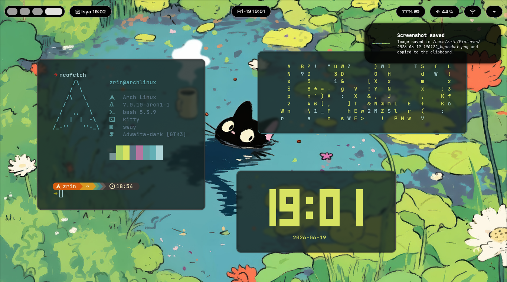
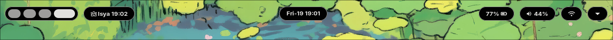
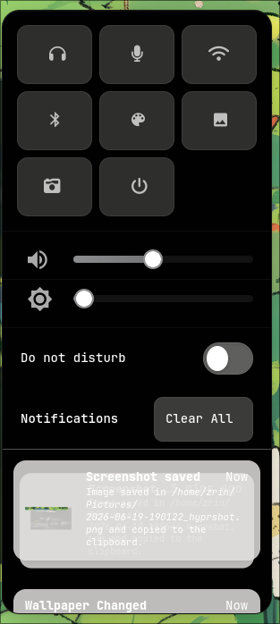
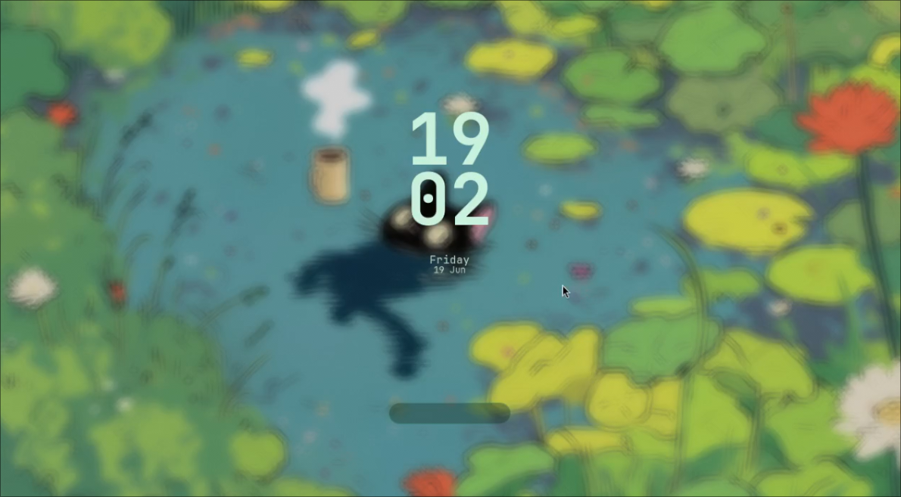

# Zrin's Dotfiles

My personal Arch Linux configuration built around **Hyprland**, **Pywal**, and a collection of custom scripts.

The main goal of this setup is simple:

> **Change the wallpaper, recolor the entire desktop.**

Instead of manually maintaining themes for every component, this setup uses **Pywal** to generate a color palette from the current wallpaper and automatically apply it across the desktop environment.

As a result, the desktop always remains visually consistent regardless of which wallpaper is active.

---

# Desktop Preview

## Main Desktop



---

## Waybar



Waybar serves as the primary status bar and displays:

* Workspaces
* Clock
* Battery information
* Audio status
* Network information
* Custom modules

Its colors are generated dynamically using Pywal.

---

## SwayNC



SwayNC is used as the notification daemon and notification center.

Features:

* Notification history
* Do Not Disturb mode
* Quick access controls
* Pywal-based color integration

---

## Hyprlock



A simple lock screen configuration designed to match the current wallpaper and desktop theme.

---

# Design Philosophy

Most desktop setups require separate themes for every application.

This setup follows a different approach:

```text
Wallpaper
    ↓
  Pywal
    ↓
┌─────────────┬─────────────┬─────────────┐
│   Waybar    │   SwayNC    │    Rofi     │
└─────────────┴─────────────┴─────────────┘
```

The wallpaper becomes the source of truth for the entire desktop.

When a wallpaper changes:

1. Pywal extracts colors from the image.
2. A new palette is generated.
3. Desktop components automatically adapt to the new colors.

This creates a consistent visual experience without manually editing themes.

---

# Core Components

| Component | Purpose                               |
| --------- | ------------------------------------- |
| Hyprland  | Wayland compositor and window manager |
| Waybar    | Status bar                            |
| SwayNC    | Notification center                   |
| Hyprlock  | Lock screen                           |
| Kitty     | Terminal emulator                     |
| Dolphin   | File manager                          |
| Rofi      | Application launcher                  |
| Swww      | Wallpaper daemon                      |
| Pywal     | Dynamic color generation              |
| PipeWire  | Audio management                      |

---

# Features

* Dynamic wallpaper-based theming
* Pywal integration across multiple components
* Custom Waybar configuration
* SwayNC notification center
* Hyprlock styling
* Wallpaper management with Swww
* Infinite Desktop workflow
* Custom shell scripts

---

# Infinite Desktop

One of the most interesting parts of this setup is the Infinite Desktop workflow.

Inspired by:

https://github.com/carlosareyesv204-cpu/hyprland-infinite-desktop

The idea is to make workspace navigation feel more fluid and less restricted compared to traditional workspace switching.

The implementation is adapted through custom scripts and Hyprland keybindings.

---

# Notes

These dotfiles are not intended to be a perfect or universal setup.

They represent my personal Linux journey, experiments, and workflow preferences while learning more about Arch Linux, Hyprland, scripting, and desktop customization.

The repository will continue to evolve over time.

---

# Credits

Infinite Desktop by:

* https://github.com/carlosareyesv204-cpu/hyprland-infinite-desktop

Special thanks to the communities behind:

* Hyprland
* Waybar
* SwayNC
* Kitty
* Pywal
* Swww
* Rofi
* Arch Linux
